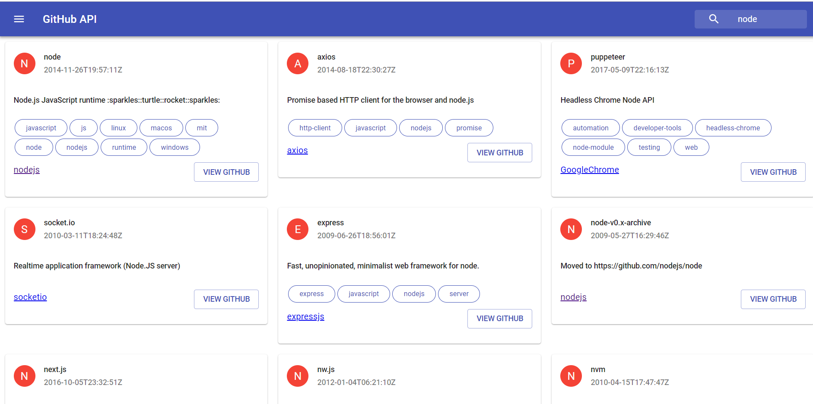

# React-Axios

A simple react application for data fetching using axios.

## Live 

https://madhumankatha.github.io/React-Axios-MaterialUi/

## Library

Axios : https://www.npmjs.com/package/axios
Material-UI : https://material-ui.com

## Install

Install dependencies uisng NPM
> npm install

Install dependencies uisng yarn
> yarn install

## Start

run project uisng NPM
> npm start

run project uisng yarn
> yarn start

### Madhumankatha/React-Axios-MaterialUi is licensed under the Apache License 2.0
